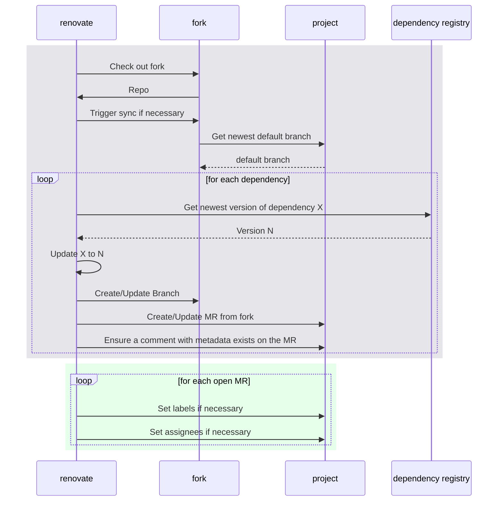

# Process

This repo consists of three main components:

1. A [config file](../renovate/) with definitions on how to update which dependency.
   See https://docs.renovatebot.com/configuration-options/ for reference
2. A post-processing script which runs on created MRs.
3. The build of a docker image containing renovate and aforementioned config.
   It is running on a [tight schedule](https://gitlab.com/gitlab-org/frontend/renovate-gitlab-bot/-/pipeline_schedules).

The main workflow consists of two parts:

1. An unprivileged account [@gitlab-renovate-bot](https://gitlab.com/gitlab-renovate-bot)
   runs renovate against a fork of the target project.

   We are using forks of projects in order to avoid security issues where a malicious dependency
   could upload secrets during our CI pipelines.

   This is supposed to mimic community contributions and reviewers / maintainers should proceed
   with similar caution to these updates in order to prevent supply chain attacks.

2. A privileged account [@gitlab-bot](https://gitlab.com/gitlab-bot) will try to assign assignees
   and labels based on the definitions from the config.

A general overview of this process is shown in the sequence diagram below.

The first box describes the renovate flow on a high level, as renovate is a complex piece of software
which can handle a lot of states an MR can be in. This is the _unprivileged_ part of the workflow.

The second box describes what the _privileged_ part of the workflow looks like.

