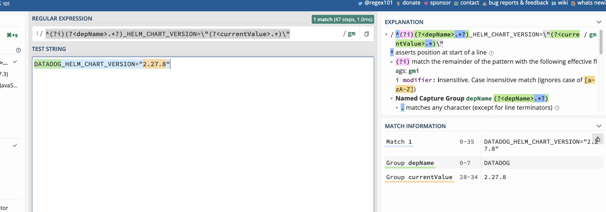
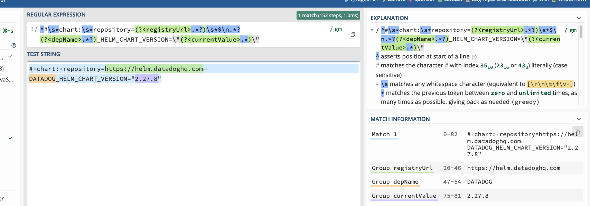
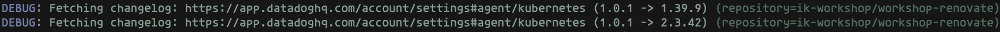
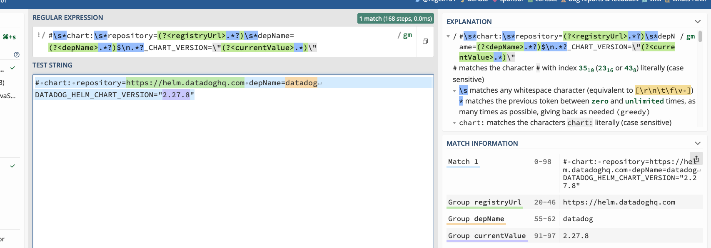
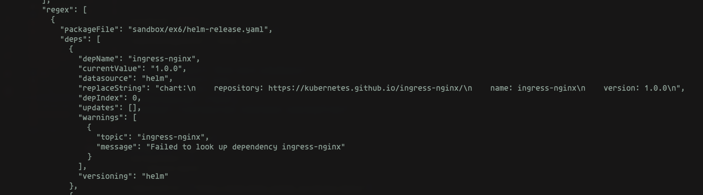
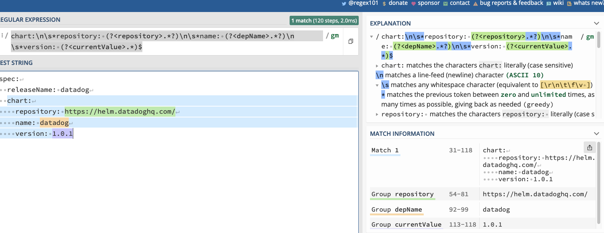
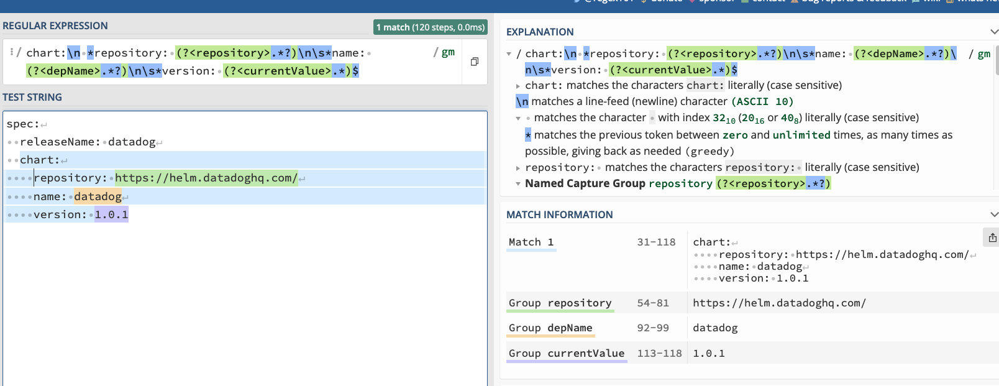
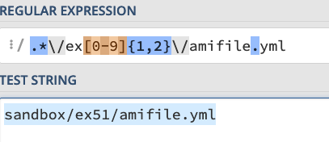

# Exercise ex6. Helm Charts Version Update Default

Update values for helm charts.

<!-- START doctoc generated TOC please keep comment here to allow auto update -->
<!-- DON'T EDIT THIS SECTION, INSTEAD RE-RUN doctoc TO UPDATE -->
## Contents

- [Output](#output)
- [Pattern Matching](#pattern-matching)
- [Resources](#resources)

<!-- END doctoc generated TOC please keep comment here to allow auto update -->

## Output

Without AWS credentials following output

```sh
make run5
```

## Pattern Matching

```yml
^#\s*chart:\s*repository=(?<registryUrl>.*?)$\n.*?(?<depName>.*?)_HELM_CHART_VERSION=\"(?<currentValue>.*)\"
# chart: repository=https://helm.datadoghq.com
DATADOG_HELM_CHART_VERSION="2.27.8"
```

```yml
^(?i)(?<depName>.*?)_HELM_CHART_VERSION=\"(?<currentValue>.*)\"
DATADOG_HELM_CHART_VERSION="2.27.8"
```

```yml
chart:\n *repository: (?<repository>.*?)\n\s*name: (?<depName>.*?)\n\s*version: (?<currentValue>.*)$
---
spec:
  releaseName: datadog
  chart:
    repository: https://helm.datadoghq.com/
    name: datadog
    version: 1.0.1
```

TODO: create a story










## Resources

```sh
DEBUG: Using file match: (^|/)requirements\.yaml$ for manager helm-requirements
DEBUG: Using file match: (^|/)values.yaml$ for manager helm-values
DEBUG: Using file match: (^|/)helmfile.yaml$ for manager helmfile
DEBUG: Using file match: (^|/)Chart.yaml$ for manager helmv3
```
